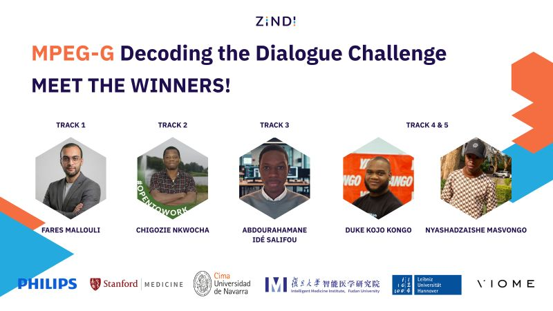

# 🥇 MPEG-G: Decoding the Dialogue — Track 1 Winner Solution

> **Challenge:** [MPEG-G: Decoding the Dialogue](https://zindi.africa/competitions/mpeg-g-decoding-the-dialogue) on Zindi  
> **Track:** Track 1 — Cytokine Level Prediction from Metagenomic Data  
> **Result:** 🏆 1st Place | CV RMSLE: **0.258076**  
> **Author:** Fares Mallouli  
> **Date:** September 2025

---

## 📌 Challenge Overview

This challenge, organized by Zindi in collaboration with Philips, Stanford Medicine, CIMA Universidad de Navarra, Fudan University, Leibniz Universität Hannover, and Viome, tasked participants with modeling and predicting host–microbiome interactions using metagenomic and cytokine data.

**Track 1 Goal:** Build a regression model to predict the levels of **66 host cytokines** from metagenomic sequence data and subject metadata.

---

## 🏆 Winners Announcement



---

## 🧬 Solution Summary

The solution is a fully self-contained machine learning pipeline that addresses the key challenges of high-dimensional genomic data, skewed target distributions, and the need for robust generalization.

### Pipeline Stages

1. **Genomic Feature Extraction** — K-mer counting (k=5, k=6) using the KMC tool  
2. **TF-IDF Transformation** — Emphasizes unique microbial signatures over raw counts  
3. **Metadata Integration** — BMI, Age, Gender, IRIS status; imputed and scaled  
4. **Target Transformation** — `log1p` applied to all 66 cytokine targets (justified by EDA)  
5. **Feature Selection** — `SelectKBest` performed inside each CV fold to prevent data leakage  
6. **Model Benchmarking** — 5-Fold CV comparison of LightGBM, MLP, and ElasticNet  
7. **Final Model** — **LightGBM** selected as best performer

### Model Performance

| Model | Overall CV RMSLE | Overall CV RMSE (Original Scale) |
|---|---|---|
| **LightGBM** | **0.258076** | **250.04** |
| MLP | 0.305244 | 354.68 |
| ElasticNet | 0.404292 | 728.77 |

---

## 🔬 Key Findings

- **Strong signals** found for cytokines: `CHEX1`, `VCAM1`, `PAI1`, `TNFA` — tightly predicted from microbiome k-mers and metadata.
- **Weak signals** found for: `EGF`, `IL22`, `IP10`, `BDNF`, `LEPTIN` — likely influenced by unmeasured variables (diet, stress, genetics).
- **BMI is not a confounding variable** across body sites — distributions are balanced, confirming that learned signals are genuine biological associations.

---

## 📁 Repository Structure
```
.
├── notebook.ipynb          # Full solution notebook (run sequentially in Kaggle)
├── report.pdf              # Full technical report submitted to Zindi
├── README.md
└── mpeg_g_decoding_the_dialogue_winners.jpg
```

---

## ⚙️ Hardware & Runtime

| Spec | Value |
|---|---|
| Environment | Kaggle Notebook |
| CPU Cores | 4 |
| RAM | 31.35 GB |
| GPU | Tesla T4 (14.74 GB) |
| Feature Engineering Time | ~22.5 minutes |
| Model Training Time | ~27.5 minutes |

---

## 🚀 How to Reproduce

1. Open `notebook.ipynb` in a **Kaggle Notebook** with a **GPU T4 accelerator** enabled.
2. The notebook auto-installs all dependencies (`kmc`, Python packages) and downloads the required datasets from Zindi.
3. Run all cells sequentially — no manual setup required.

> ⚠️ All randomness is seeded. Re-running the notebook will reproduce the same CV RMSLE score.

---

## 📦 Data

Data is provided by the challenge organizers and available on the [Zindi competition page](https://zindi.africa/competitions/mpeg-g-decoding-the-dialogue). Key files used:

| File | Description |
|---|---|
| `TrainFiles.zip` | FASTQ files (raw metagenomic sequences) |
| `Train.csv` | Sample type information |
| `Train_Subjects.csv` | Subject-level metadata (BMI, Age, Gender, etc.) |
| `cytokine_profiles.csv` | Target cytokine measurements |

---

## 📜 License

Data is provided under a **CC-BY 1.0** license per challenge rules. Code in this repository is released under the **MIT License**.

---

## 🤝 Acknowledgements

Thanks to the challenge organizers: **Philips**, **Stanford Medicine**, **CIMA Universidad de Navarra**, **Fudan University (Intelligent Medicine Institute)**, **Leibniz Universität Hannover**, and **Viome**, as well as the Zindi team for hosting this challenge.
